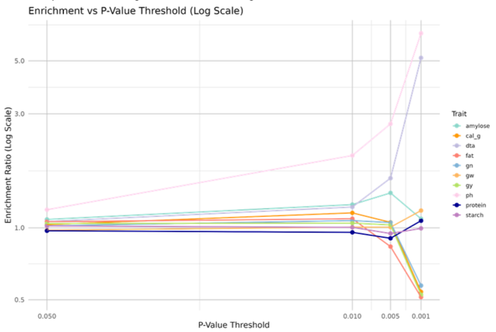

# Pairwise Epistatic Interactions and Their Functional Consequences in Sorghum
*A reproducible R pipeline for detecting SNP–SNP interactions using {targets} and MM4LMM*

## Overview

This project was completed as a semester-long Project in Bioinformatics (5 ECTS) during my Master's degree at Aarhus University. This project explores the role of genetic interactions (epistasis) in shaping the genetic architecture of complex traits in Sorghum bicolor. Using single-nucleotide polymorphism (SNP) data and phenotypic information, we developed a modular and reproducible R pipeline for epistasis analysis to detect significant SNP-SNP interactions. The pipeline automates the entire process from VCF processing to statistical model fitting. The project was done in collaboration with Eleni Nikolaidou under the supervision of Thomas Bataillon and Guillaume Ramstein.

## Features

- **Preprocessing**: Loads pruned genotype data, phenotypes, kinship matrix, and PCs for analysis.  
- **Epistasis Modeling**: Fits SNP–SNP interaction models using MM4LMM with covariate control (kinship + PCs).  
- **Significance Testing**: Provides z-score and LRT-based p-values with Benjamini–Hochberg FDR correction.  
- **Visualization & Summaries**: Creates q-value distributions, enrichment plots, interaction strength comparisons, and SNP-level summaries.  
- **Reproducible Pipeline**: Automated with {targets} for modularity, caching, and reproducible reruns.  


## Repository Structure

```text
├── docs/                  # Project report (PDF)
├── results/               # Curated output plots (example results)
├── scripts/
│   ├── pipeline/          # Core functions used by the {targets} pipeline
│   │   ├── load_n_proc.R
│   │   ├── mm4lmm_fitting.R
│   │   └── extract_reml_info.R
│   └── analysis/          # Standalone scripts for downstream analysis & visualization
│       ├── adjust_fdr_bh.R
│       ├── plot_qval_distribution.R
│       └── ...
├── .gitignore
├── CITATION.cff
├── LICENSE
└── README.md

```

## Dependencies
- R version 4.4.1

> Note: Running the pipeline via `{targets}` will auto-install its required packages (see `_targets.R`).  
> The standalone scripts in `scripts/analysis/` assume packages are already installed.

## How to Run 

To run the main pipeline: 

```r
targets::tar_make
```
To run an analysis script (example: applying FDR correction):

```bash
Rscript scripts/analysis/adjust_fdr_bh.R results/
```

## Scripts Overview

**Pipeline (core functions used by `_targets.R`):**

- _targets.R: Main targets pipeline script, integrating all steps for data processing and model fitting.

- load_n_proc.R: Loads and processes genotype and phenotype data.

- mm4lmm_fitting.R: Fits REML models and manages variance structures.

- extract_reml_info.R: Extracts SNP interaction results from REML models.

**Analysis (downstream scripts for post-processing and visualization):**

- extract_and_plot.R: Computes and visualizes p-value distributions.

- add_interaction_pvalues.R: Calculates z-scores and p-values for SNP–SNP interaction terms and updates .qs result files.

- adjust_fdr_bh.R: Applies Benjamini–Hochberg FDR correction to interaction p-values and updates result files.

- classify_and_plot_significant_interactions.R: Merges marginal and interaction results, filters significant SNP–SNP effects, classifies significance patterns, and generates comparative plots.

- interaction_strength_boxplot.R: Compares interaction strength between SNPs with and without significant marginal effects using boxplots.

- plot_interaction_pvalues.R: Plots detailed histograms of SNP–SNP interaction p-value distributions.

- plot_qval_distribution.R: Visualizes FDR-adjusted q-value distributions for SNP–SNP interactions.

- summarize_significant_interactions.R: Summarizes SNPs with significant marginal and interaction effects, saves results, and plots the top 20 interaction hotspots.

- chi_sq_test_2x2.R: Performs a Chi-squared test on a 2×2 contingency table of marginal vs. interaction significance, checks test assumptions, reports enrichment ratio, and prints results to the console.

- build_2x2_tables.R: Generates 2×2 contingency tables of marginal vs. interaction significance across multiple traits, saving each table as a .qs file.

- plot_enrichment_vs_threshold.R: Aggregates enrichment ratios across traits and significance thresholds, plotting enrichment vs. p-value threshold on the log-scale.

## Example Result

This enrichment plot shows how enrichment ratios vary across traits and significance thresholds.  
It highlights the type of insights produced by the pipeline.



## Documentation
See the full project report in [`docs/Pairwise_Epistasis_Sorghum_Report.pdf`](docs/Pairwise_Epistasis_Sorghum_Report.pdf).

